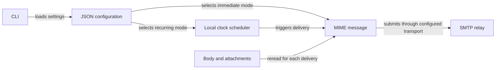

# Architecture

## Overview

Auto Announcements is a standard-library Python mailer. All application logic
lives in `send/send.py`; the entry points share `main()`.



## Components

### Configuration

`load_config()` merges defaults, validates settings, and resolves paths relative
to the JSON file. Interactive mode prompts for addresses and uses the current
directory. Passwords are read from the environment at delivery time.

### Messages and transport

`build_message()` builds an `EmailMessage` with the current body, attachments,
date, and message ID. `send_announcement()` connects with plain SMTP, STARTTLS,
or implicit TLS. A context manager closes each connection.

### Scheduling

`next_run()` calculates the next future daily or weekly local time.
`run_schedule()` checks the clock at most every 30 seconds while waiting and
attempts one submission per occurrence. It continues after delivery failures.
There is no persistent queue or delivery history.

## Data flow

For example, `python -m send --config config.json --schedule` loads and validates
the configuration, verifies the files and password availability, then waits.
When the time arrives, it rereads all files and submits the message. It calculates
the next future time after the attempt.

## Directory layout

```text
send/
    send.py             Configuration, MIME, SMTP, scheduler, CLI
    __init__.py         Public main export
    __main__.py         python -m send
__main__.py             Root script entry point
config.example.json    Example SMTP and weekly schedule
message.html           Editable sample body
tests/test_send.py      Configuration, transport, and calendar tests
```
